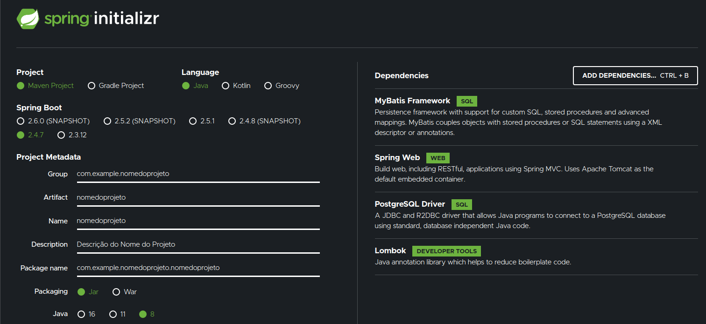
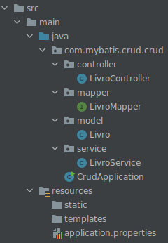

# DESENVOLVENDO O PROJETO

## Criando um projeto inicial no https://start.spring.io

#### Utilizei as seguintes configurações:


#
## Utilize a sua IDE e crie e estrutura de packages, classes e integrfaces

### Abra o Intellij IDEA ou a IDE que esteja utilizando e siga os passos:

#
##### Configure a estrutura de pacotes e classes necessárias para o projeto
```
Crie dentro de scr/main/java/nomedo_group_criado_em_startspring_io
```

#### Clique com botão direito e escolha new > package para criar controller, mapper, service e model. Depois clique em cada package novo criado com o botão direito para criação de classes e interfaces

```
A estrutura ficará com a imagem
```


#
## Configure o controller LivroController (tipo: java class)

```
package com.mybatis.crud.crud.controller;
import java.util.List;

import com.mybatis.crud.crud.model.Livro;
import org.springframework.beans.factory.annotation.Autowired;
import org.springframework.http.HttpStatus;
import org.springframework.http.ResponseEntity;
import org.springframework.web.bind.annotation.DeleteMapping;
import org.springframework.web.bind.annotation.GetMapping;
import org.springframework.web.bind.annotation.PathVariable;
import org.springframework.web.bind.annotation.PostMapping;
import org.springframework.web.bind.annotation.PutMapping;
import org.springframework.web.bind.annotation.RequestBody;
import org.springframework.web.bind.annotation.RequestMapping;
import org.springframework.web.bind.annotation.RestController;
import com.mybatis.crud.crud.service.LivroService;

@RestController
@RequestMapping("/livros")
public class LivroController {
    @Autowired
    LivroService livroService;
    @PostMapping
    public ResponseEntity<Livro> save(@RequestBody Livro livro) {
        try {
            livroService.save(livro);
            return ResponseEntity.status(HttpStatus.CREATED).body(livro);
        } catch (Exception e) {
            e.printStackTrace();
            throw new RuntimeException("Ocorreu um erro inesperado");
        }
    }
    @PutMapping
    public ResponseEntity<Livro> update(@RequestBody Livro livro) {
        try {
            livroService.update(livro);
            return ResponseEntity.status(HttpStatus.ACCEPTED).body(livro);
        } catch (Exception e) {
            e.printStackTrace();
            throw new RuntimeException("Ocorreu um erro inesperado");
        }
    }
    @DeleteMapping(value = "/{livroId}")
    public ResponseEntity<Livro> delete(@PathVariable("livroId") Long livroId) {
        try {
            livroService.delete(livroId);
            return ResponseEntity.status(HttpStatus.NO_CONTENT).build();
        } catch (Exception e) {
            e.printStackTrace();
            throw new RuntimeException("Ocorreu um erro inesperado");
        }
    }
    @GetMapping
    public ResponseEntity<?> select() {
        try {
            List<Livro> livros = livroService.select();
            return ResponseEntity.status(HttpStatus.OK).body(livros);
        } catch (Exception e) {
            e.printStackTrace();
            return ResponseEntity.status(HttpStatus.INTERNAL_SERVER_ERROR).body("Ocorreu um erro inesperado");
        }
    }
}
```
#
## Configure o mapper LivroMapper (tipo: interface)

```
package com.mybatis.crud.crud.mapper;

import java.util.List;
import com.mybatis.crud.crud.model.Livro;
import org.apache.ibatis.annotations.Delete;
import org.apache.ibatis.annotations.Insert;
import org.apache.ibatis.annotations.Mapper;
import org.apache.ibatis.annotations.Select;
import org.apache.ibatis.annotations.Update;

@Mapper
public interface LivroMapper {

    @Insert("INSERT INTO livros(titulo,isbn,autor,edicao,editora) "
            + "VALUES (#{titulo},#{isbn},#{autor},#{edicao},#{editora})")
    public int insert(Livro livro);

    @Update("UPDATE livros SET titulo=#{titulo},isbn=#{isbn},"
            + "autor=#{autor},edicao=#{edicao},editora=#{editora} WHERE livro_id=#{livroId}")
    public int update(Livro livro);

    @Select("SELECT livro_id AS livroId,titulo,isbn,autor,edicao,editora FROM livros")
    public List<Livro> select();

    @Delete("DELETE FROM livros WHERE livro_id=#{livroId}")
    public int delete(Long livroId);
}
```

#
## Configure o model Livro

```
package com.mybatis.crud.crud.model;

public class Livro {
    private Long livroId;
    private String titulo;
    private String isbn;
    private String autor;
    private String editora;
    private Integer edicao;

    public Long getLivroId() {
        return livroId;
    }
    public void setLivroId(Long livroId) {
        this.livroId = livroId;
    }
    public String getTitulo() {
        return titulo;
    }
    public void setTitulo(String titulo) {
        this.titulo = titulo;
    }
    public String getIsbn() {
        return isbn;
    }
    public void setIsbn(String isbn) {
        this.isbn = isbn;
    }
    public String getAutor() {
        return autor;
    }
    public void setAutor(String autor) {
        this.autor = autor;
    }
    public String getEditora() {
        return editora;
    }
    public void setEditora(String editora) {
        this.editora = editora;
    }
    public Integer getEdicao() {
        return edicao;
    }
    public void setEdicao(Integer edicao) {
        this.edicao = edicao;
    }
}
```

## Configure o service LivroService

```
package com.mybatis.crud.crud.service;

import java.util.List;
import com.mybatis.crud.crud.model.Livro;
import com.mybatis.crud.crud.mapper.LivroMapper;
import org.springframework.beans.factory.annotation.Autowired;
import org.springframework.stereotype.Service;


@Service
public class LivroService {
    @Autowired
    LivroMapper mapper;
    public void save(Livro livro) {
        this.mapper.insert(livro);
    }
    public void update(Livro livro) {
        this.mapper.update(livro);
    }
    public void delete(Long livroId) {
        this.mapper.delete(livroId);
    }
    public List<Livro> select() {
        List<Livro> livros = this.mapper.select();
        return livros;
    }
}
```
#
### Execute o projeto e teste as rotas exemplificadas em [Rotas de Teste](RotasDeTeste.md)