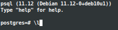
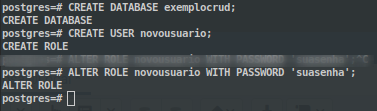
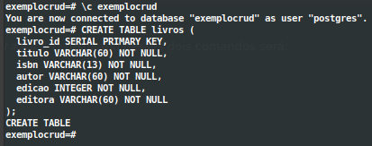

# Instale o postgres via terminal

```
Aqui instalei a versão 11 no debian 10, mas você pode utilizar o banco containerizado se preferir. 
Não testei com outra versão, mas acredito que funcionará também com outras versões e outros SOs.
```

## Comandos para instalar o postgres no debian10

#### Passo 1: Atualiza e instala pacotes necessaŕios, caso não tenha

```
sudo apt update && sudo apt install -y curl ca-certificates gnupg
```

#### Passo 2: Adiciona chave gpg

```
curl https://www.postgresql.org/media/keys/ACCC4CF8.asc | sudo apt-key add -
```
#### Passo 3: Adicona um arqquivo/list para baixar pacotes com o comando 'apt update'

```
sudo sh -c "echo 'deb http://apt.postgresql.org/pub/repos/apt/ buster-pgdg main' >> /etc/apt/sources.list.d/pgdg.list"
```

#### Passo 4: Atualize os pacotes para instalar o postgres11

```
sudo apt update && sudo apt install -y postgresql-11
```

## Acesse o postgres para criar sua base e usuário para ser utilizado nas configurações de banco

```
1º: sudo -i su postgres
2º: psql

```
##### Você terá uma tela como essa



##### Crie a base exemplo 

```
CREATE DATABASE exemplocrud;
```

##### Crie um novo usuário para usar na configuração de conexão com o banco

```
CREATE USER novousuario;
```

##### Defina uma senha para o usuário criado

```
ALTER ROLE novousuario WITH PASSWORD 'suasenha';
```
#
### O resultado dos comandos deve ser:



#
## Conectando na database exemplocurd

```
\c exemplocrud
```

## Crie uma tabela na database criada (exemplocrud)

```
CREATE TABLE livros(
  livro_id SERIAL PRIMARY KEY,
  titulo VARCHAR(60) NOT NULL,
  isbn VARCHAR(13) NOT NULL,
  autor VARCHAR(60) NOT NULL,
  edicao INTEGER NOT NULL,
  editora VARCHAR(60) NOT NULL
);
```
#
#### O resultado desses dois comandos será:



#
#### Siga agora para o desenvolvimento do CRUD
- CRUD.MD